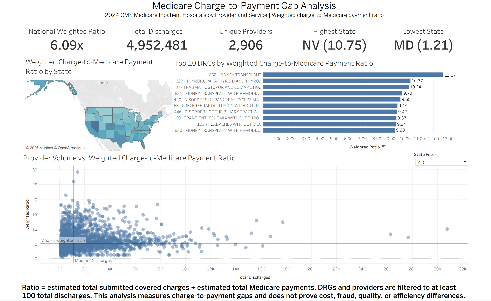

# Medicare Charge-to-Payment Gap Analysis

## Executive Summary

This project analyzes 2024 CMS Medicare inpatient hospital data to identify patterns in the gap between average submitted covered charges and average Medicare payments across states, DRGs, and providers. The primary KPI is a discharge-weighted charge-to-Medicare payment ratio, calculated by comparing estimated total submitted covered charges with estimated total Medicare payments. The analysis uses publicly reported inpatient discharge data for Original Medicare Part A beneficiaries at IPPS hospitals and highlights geographic, service-line, and provider-level differences in charge-to-payment gaps. These results are descriptive and do not prove hospital cost, fraud, quality problems, or operational inefficiency.

## Business Question
Which states, DRGs, and providers show the largest gaps between submitted charges and Medicare payments?

## Dataset

This project uses the **2024 CMS Medicare Inpatient Hospitals by Provider and Service** dataset, also known as the Medicare IPPS provider-and-service dataset.

**Source:** https://data.cms.gov/provider-summary-by-type-of-service/medicare-inpatient-hospitals/medicare-inpatient-hospitals-by-provider-and-service/data

**Year used:** 2024  
**Downloaded file:** `Medicare_IP_Hospitals_by_Provider_and_Service_2024.csv`  
**Rows:** 145,879  
**Original columns:** 15  

Each row represents a **provider-DRG combination**, meaning one hospital/provider can appear multiple times for different Diagnosis-Related Groups. The dataset includes provider identifiers, provider location, DRG codes and descriptions, total discharges, average submitted covered charges, average total payments, and average Medicare payments.

The analysis focuses on Original Medicare inpatient activity for IPPS hospitals. It does not represent all hospital patients, all payer types, commercial insurance payments, or total hospital revenue.

### Key Fields

| Field | Description |

| `rndrng_prvdr_ccn` | CMS Certification Number used as the primary provider identifier. |
| `rndrng_prvdr_org_name` | Provider or hospital organization name. |
| `rndrng_prvdr_state_abrvtn` | Provider state abbreviation. |
| `drg_cd` | Diagnosis-Related Group code. |
| `drg_desc` | Diagnosis-Related Group description. |
| `tot_dschrgs` | Total inpatient discharges for the provider-DRG combination. |
| `avg_submtd_cvrd_chrg` | Average submitted covered charge. This reflects submitted charges, not actual hospital cost or collected revenue. |
| `avg_tot_pymt_amt` | Average total payment amount. |
| `avg_mdcr_pymt_amt` | Average Medicare payment amount. This is used as the denominator for the main charge-to-payment ratio. |
| `weighted_ratio` | Discharge-weighted charge-to-Medicare payment ratio, calculated as estimated total submitted covered charges divided by estimated total Medicare payments. |

## Methodology

The main metric in this project is the **charge-to-Medicare payment ratio**, which compares average submitted covered charges with average Medicare payments.

For final reporting, the project uses a **discharge-weighted ratio** rather than a simple average of row-level ratios:

`weighted ratio = estimated total submitted covered charges / estimated total Medicare payments`

Where:

- `estimated total submitted covered charges = avg_submtd_cvrd_chrg × tot_dschrgs`
- `estimated total Medicare payments = avg_mdcr_pymt_amt × tot_dschrgs`

This weighted approach gives more influence to provider-DRG rows with higher discharge volume and reduces the risk of low-volume rows distorting the results.

Provider-level analysis uses `rndrng_prvdr_ccn` as the primary provider identifier, with hospital name and state included for readability. DRG and provider summaries were filtered to include only groups with at least **100 total discharges**.

## Tableau Dashboard

The Tableau dashboard summarizes charge-to-Medicare payment gaps across geography, service lines, and providers.

Dashboard components include:

- KPI cards for national weighted ratio, total discharges, unique providers, highest-ratio state, and lowest-ratio state
- A U.S. map showing weighted charge-to-Medicare payment ratio by state
- A bar chart showing the top 10 meaningful-volume DRGs by weighted ratio
- A provider scatter plot comparing total discharges with weighted ratio
- A state filter for reviewing provider-level patterns within selected states



## Tableau Public Link

Tableau Public dashboard: `[Add Tableau Public link here after publishing]`

## Key Findings

- The national discharge-weighted charge-to-Medicare payment ratio was **6.09x**, meaning estimated submitted covered charges were about 6.09 times estimated Medicare payments across the dataset.

- **Nevada had the highest state-level weighted ratio at 10.75x**, while **Maryland had the lowest at 1.21x**. This shows large geographic variation in charge-to-Medicare payment gaps.

- **Kidney transplant was the highest-ratio meaningful-volume DRG**, with a weighted ratio of **12.67x** after applying the 100-discharge threshold.

- Several high-ratio providers remained visible after switching from hospital-name grouping to CMS provider CCN grouping, including **Capital Health Medical Center - Hopewell**, which had the highest provider-level weighted ratio among providers with at least 100 discharges.

- The provider scatter plot shows that high weighted ratios are not limited to the highest-volume providers. Many providers cluster at lower discharge volumes, while some higher-volume providers still show elevated charge-to-payment gaps.

## Recommendations

1. **Hospital CFOs should review high-ratio service lines before making pricing decisions.**  
   DRGs such as kidney transplant showed large weighted charge-to-Medicare payment gaps even after applying a volume threshold. These service lines may warrant financial review, but the ratio alone does not prove excessive cost or inefficiency.

2. **Payer and reimbursement teams should benchmark high-ratio states against national and regional patterns.**  
   States such as Nevada and Florida showed high weighted ratios, while Maryland showed a much lower ratio. These differences may reflect reimbursement policy, provider mix, service mix, or market structure and should be interpreted with additional context.

3. **Provider-level outliers should be reviewed using CCN-based identifiers rather than hospital names alone.**  
   Provider CCN is more reliable than organization name for identifying facilities. High-ratio providers should be reviewed with additional operational, payer-mix, and service-line data before drawing conclusions.

4. **Analysts should use weighted ratios for executive reporting.**  
   Simple averages can overstate the influence of low-volume provider-DRG rows. Discharge-weighted ratios provide a more stable view of charge-to-payment gaps across states, DRGs, and providers.

## Limitations

- Submitted covered charges are not the same as actual hospital costs.
- Medicare payments are not the same as total hospital revenue.
- A high charge-to-Medicare payment ratio does not prove fraud, overcharging, poor quality, or operational inefficiency.
- The dataset covers Medicare inpatient activity for Original Medicare Part A beneficiaries, not all patients or payer types.
- Discharge volume is used as a proxy for operational scale, but it does not capture hospital size, case complexity, staffing, or resource use directly.
- State-level differences may reflect payment policy, provider mix, service mix, geographic adjustments, teaching status, or other factors not fully captured in this analysis.
- The analysis is descriptive, not causal or predictive.

## Tools Used

- Python
- pandas
- Tableau
- Matplotlib / Seaborn
- Jupyter Notebook
- GitHub


## How to Run the Project

1. Clone the repository.
2. Download the 2024 CMS Medicare Inpatient Hospitals by Provider and Service dataset from CMS.
3. Place the raw CSV file in:

   `data/raw/`

4. Open and run the Jupyter notebook to reproduce the cleaning, KPI creation, weighted methodology, and export steps.
5. Tableau-ready CSV files are exported to:

   `data/tableau_exports/`

6. Open the Tableau packaged workbook:

   `tableau/project_6_medicare_charge_gap.twbx`

## Repository Structure

```text
Project-6-Medicare-Charge-Gap/
│
├── data/
│   ├── raw/
│   │   └── Medicare_IP_Hospitals_by_Provider_and_Service_2024.csv
│   └── tableau_exports/
│       ├── state_summary_final.csv
│       ├── drg_summary_final.csv
│       ├── provider_summary_final.csv
│       └── kpi_summary_final.csv
│
├── images/
│   └── project_6_tableau_dashboard.png
│
├── notebooks/
│   └── medicare_charge_gap_analysis.ipynb
│
├── tableau/
│   └── project_6_medicare_charge_gap.twbx
│
├── README.md
└── .gitignore

